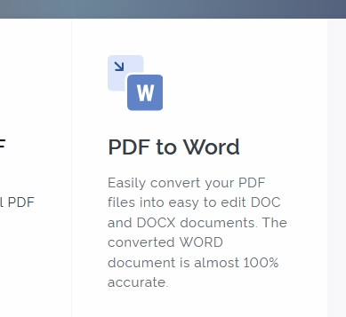
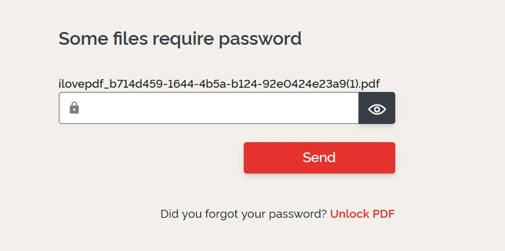
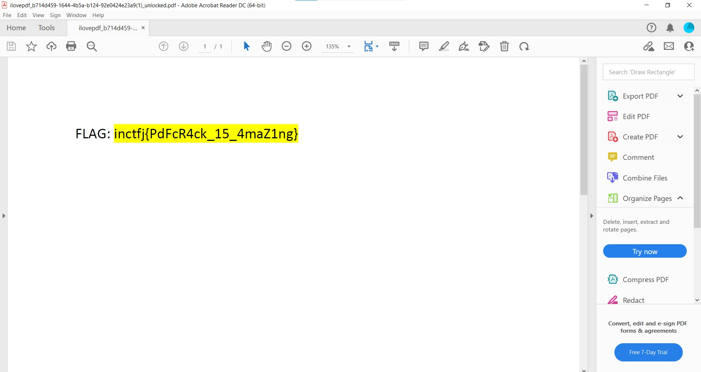

# I LOVE PDF

Description -
`Kevin forgot his protected pdf password.Can you help him to retrieve the password.`So as we can guess, we have to brute-force password of pdf file. If you look at https://wiki.bi0s.in/steganography/pdfcrack/ (the offical website of the people who hosted this ctf) We can see PDFCrack to brute-force password but it was'nt working on my laptop so I googled `ILOVEPDF` and the first link I got - https://www.ilovepdf.com/ now I clicked on `PDF to Word` -

Now after putting the file to convert it to word, I got -

I clicked on Unlock PDF then put the file over there and clicked on unlock pdf and then clicked on `Download Unlocked PDF` -

and then opened it and guess what!

# Flag - inctfj{PdFcR4ck_15_4maZ1ng}

